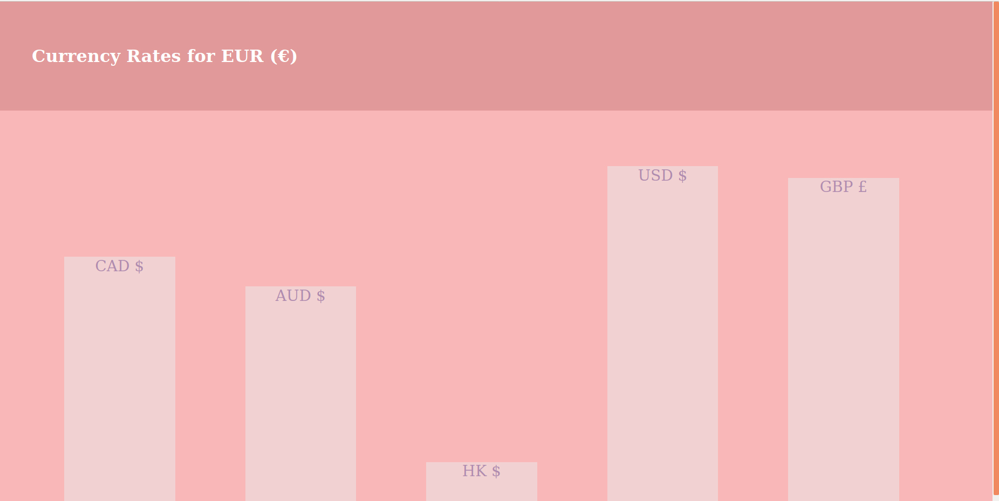
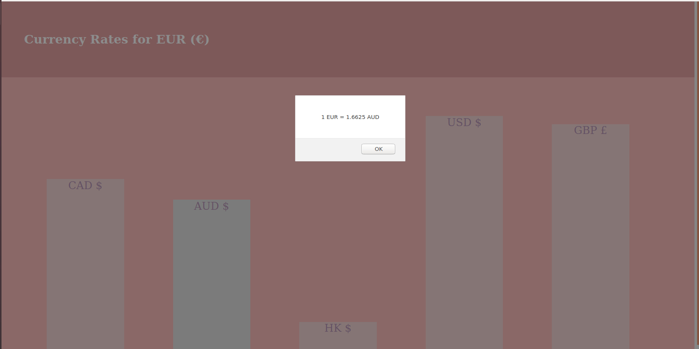

# Current Exchange Rate Bar-Chart

This project intends to portray a bar chart that displays data found from a currency exchange API. 

## About

This is a project for the coding bootcamp [Kickstart Coding](http://kickstartcoding.com/). The bar chart visually displays the currency rate from Euros (€) to other currencies.

### Features

* Basic JavaScript interaction
    * When users hover over a bar, it will change colours. 
    * When users then click on a bar, a JavaScript alert will appear and indicate the selected currency exchange.

## Credits

This project uses data from an [exchange rate API](https://api.exchangeratesapi.io/latest).